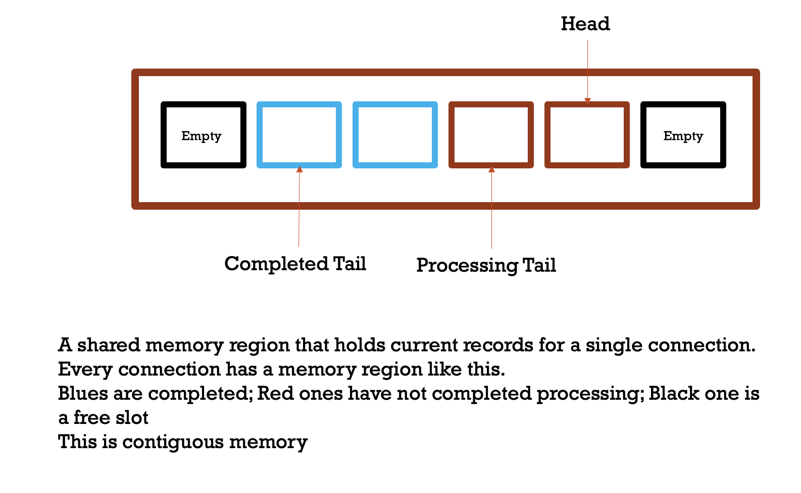
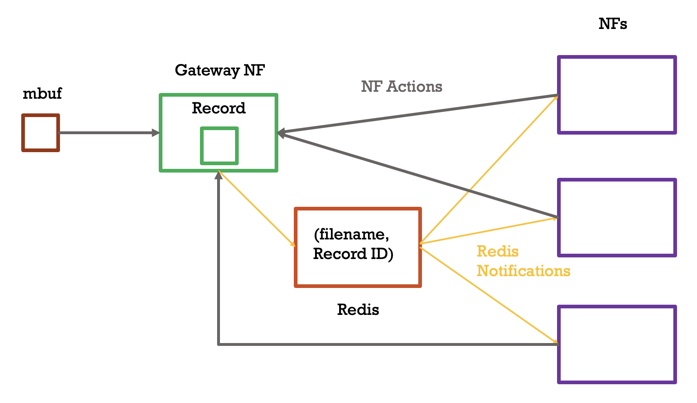

# SIFT: Secure, Isolated and Fault Tolerant Packet Processing

SIFT is built on top of [openNetVM](https://github.com/sdnfv/openNetVM) 
It is a framework to assist in writing network functions where:

1. each connection is isolated
2. the data is immutable for the NFs
3. all connections maintain their state and can be completely replayed back in case of failure of backends or NFs

## Overall Design

- the gateway NF creates a ***shared memory file for each active connection*** triggered by the first packet of a new connection
- each packet is passed to the gateway NF which creates a ***record struct by extracting IP and TCP header information***
- the records are stored in the shared memory files corresponding to the connection to which the packet belongs. This dissassociates the data buffer from the header and ***prevents NFs from directly accessing packet data***
- if NFs need to change some data, like rewriting destination IP or port, then that change is sent to the ***gateway NF which will verify the changes and merge into the record***

## NF Bitmaps

The gateway NF holds a ***global bitmap where each bit is mapped to a registered NF***

Every record also holds a corresponding bitmap indicating which NFs have completed processing this record. ***Comparing per-record bitmaps to the global bitmap allows the gateway to determine which packets have been completely processed***

- the per packet and global bitmaps enable the gateway to partition records into `processed` and `completed` (look at `Gateway Entry Structs`).
- plus they enable the gateway to know which NFs are yet to process a record and allows to recover easily from NF failures.
- the global bitmap also allows the gateway to track authorised NFs
- further maintaining a per-connection bitmap will enable NFs to register for specific connections only

## Record Removal

Records are ***removed*** from the shared files only ***when*** an ***acknowledgement*** for the corresponding packet ***is received from the backend***

## Record IDs

- first packet of each connection is given a random 64 bit ID
- subsequent packets get an ID incremented by 1. the `rte_mbuf` struct is stored separately with the ID to identify the buffer associated with the record later
- a redis server holds the identity of every connection and the latest record ID
- whenever a new packet arrives and new record is created, the redis key is updated (typically in bursts) and the NFs are informed through Redis keyspace notifications

## Entry Structs

Both the gateway and other NFs maintain an `Entry` struct for each connection. The struct holds the following information:

1. name of the file corresponding to this connection
2. the virtual memory pointer
3. offset at which the next packet to be processed by the NF (for the gateway, this is the first packet still not processed by all NFs)
4. offset at which the latest (known) packet of this connection has been added

## Gateway Entry Struct

The gateway holds one extra offset in its Entry struct which points to the oldest record for which the corresponding packet has been processed by all NFs but the gateway is yet to receive an acknowledgement from the backend application for the packet.

This allows the gateway to replay all unacknowledged packets in case of a backend failure.

## Shared Memory

## Notifications

## Advantages

- no requirement for explicit synchronisation between NFs and the gateway/mgr
- all connections are completely isolated
- no NF can directly modify data; modifications are verified
- connection state is maintained and can be replayed
- NF registration and per-packet bitmaps allow to recover from NF failures

## Challenges

- records are disassociated from `rte_mbuf` structs. While this enhances security, it also means that an explicit mapping between `rte_mbufs` and record need to be maintained
- verifying and merging modified data need to be fast
- the connection state being maintained may not form fully formed application level messages and replays may be meaningless without synchronisation with an application layer gateway

## Note on Testing

1. If keys added to redis are not removed, the program may throw `segmentation faults` - `redis-cli flushall`

